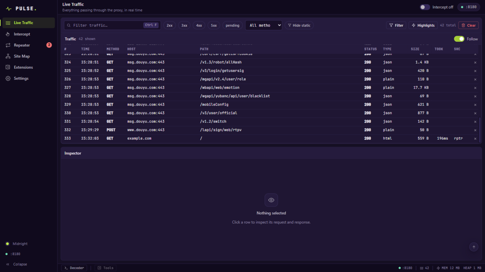
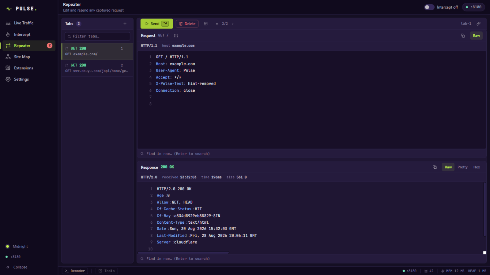

<div align="center">

# ⚡ Pulse

**通过浏览器操控的本地 Web 安全测试平台**

对标 Burp Suite / Caido 核心工作流的 MITM 抓包、拦截改包、重放、重写与插件扩展工具。


[快速开始](#-快速开始) · [核心能力](#-核心能力) · [插件系统](#-插件系统) · [文档](#-文档)

</div>

---

## 📸 核心界面

**Live Traffic** —— 实时 MITM 抓包：虚拟化流量表格（5000 行流畅滚动）、多维过滤与高亮、右键联动 Repeater / cURL，检查器内 Headers / Params / Pretty / Hex / WebSocket 逐帧查看：

<div align="center"></div>

**Repeater** —— Burp 式 raw 重放编辑器：请求行 + 头 + 体单缓冲区改包，`Ctrl+Enter` 即改即发，响应实时渲染，标签自动保存：

<div align="center"></div>

> 内置 **Warm 炭灰 / Midnight 午夜 / Linear** 三套主题，全程离线本地运行，流量不出你的机器。

## ✨ 核心能力

| 模块 | 能力 |
| --- | --- |
| **Proxy** | HTTP/HTTPS MITM 抓包，SSE 实时**虚拟化**表格（5000 行、列宽拖拽、列头排序），多维过滤 + 高级过滤器 + 8 色高亮规则，gzip/br 自动解压，JSONL 持久化重启恢复，右键 Send to Repeater / Copy as cURL / 深链接直达 |
| **Intercept** | 请求挂起队列，改方法/URL/头/体后放行或丢弃，`F` / `D` 快捷操作 |
| **Site Map** | host→path→method 端点树聚合（状态着色、搜索），点击检查最新请求/响应 |
| **Repeater** | raw 编辑器改包重发，标签持久化/搜索/标记，响应即查 |
| **Extensions** | **Match & Replace**（5 作用域、正则/字面量、命中计数）；**JS 插件**（onRequest/onResponse 钩子，隔离 VM + 2s 超时，热重载，日志面板，**CodeMirror 在线编辑器**：Check 干跑校验 / 沙箱 Test run / 一键写入插件目录，**插件目录可配置**，内置样例代码） |
| **WebSocket** | RFC 6455 帧级捕获：text/binary/close/ping/pong 双向记录，检查器内专页查看 |
| **Settings** | CA 证书下载与各平台安装指引、运行状态、快捷键速查 |

请求管线顺序：`插件 → 重写规则 → 拦截 → 上游`；存储的流量始终是实际发送/接收的最终形态。Repeater 发送不经插件与重写（与 Burp 默认一致）。

## 🚀 快速开始

前置：Go 1.25+，Node 18+（仅构建前端需要）。

```bash
# 构建单一二进制（前端产物内嵌）
cd web && npm install && npm run build && cd ..
go build -o pulse.exe ./cmd/pulse        # Linux/macOS: -o pulse

# 运行：代理 127.0.0.1:8080，控制台 127.0.0.1:8000
./pulse.exe
# 自定义：--proxy :9090 --ui :9000 --data-dir D:/pulse-data
```

打开控制台 <http://127.0.0.1:8000>。

### 抓取 HTTPS（一次性）

1. Settings 页下载 CA 证书（`pulse-ca.pem`）。
2. 安装到信任库：
   - **Windows**：`certmgr.msc` → 受信任的根证书颁发机构 → 导入（或 `certutil -addstore -user root pulse-ca.pem`）。
   - **macOS**：钥匙串访问 → 系统 → 导入 → 双击设为“始终信任”。
   - **Firefox**：设置 → 隐私与安全 → 证书 → 导入 → 勾选信任 CA。
3. 浏览器代理指向 `127.0.0.1:8080`（可配 SwitchyOmega），访问任意站点即出现在流量表。

> 仅在测试环境信任 Pulse CA，测试结束建议移除。Pulse 永远不会自动修改你的系统信任库。

<details>
<summary><b>架构</b></summary>

```
┌────────────┐  代理流量(HTTP/HTTPS)   ┌─────────────┐   ┌──────────┐
│ 浏览器/客户端 ├──────────────────────▶│ Pulse :8080 ├──▶│ 目标服务器 │
└────────────┘                        │  (MITM 引擎) │   └──────────┘
┌────────────┐   REST + SSE (控制)    │             │
│ 控制台浏览器  ├──────────────────────▶│ Pulse :8000 │
└────────────┘                        └─────────────┘
```

- 后端：Go（标准库 + goja JS 运行时，单二进制内嵌前端）
- 前端：React + TypeScript + CodeMirror 6（构建产物内嵌，运行时零外部依赖、零网络请求）

</details>

<details>
<summary><b>开发模式</b></summary>

```bash
# 一键开发环境（macOS / Linux / Git Bash）：后端 + Vite 热更新，Ctrl+C 一并停止
./dev.sh                     # 控制台 http://127.0.0.1:5175，代理 :8080
PROXY_PORT=9090 ./dev.sh     # 换代理端口

# 或手动分开跑：
# 终端 1：后端
go run ./cmd/pulse
# 终端 2：前端（热更新，/api 代理到 8000）
cd web && npm run dev    # http://127.0.0.1:5175
```

</details>

## 🧩 插件系统

放在插件目录下的 JavaScript 文件（ES5.1+，goja 运行时），可观察并修改经过代理的每一个请求与响应——无需安装任何东西：

```js
plugin = { name: "Add Header", version: "1.0" };

function onRequest(ctx) {
  ctx.request.headers.push({ name: "X-Powered-By", value: "pulse" });
  pulse.log("tagged " + ctx.request.url);
}
```

控制台内置在线编辑器：**Check** 干跑编译（错误精确到行列）、**Test run** 沙箱试跑（零流量）、一键保存到插件目录热加载；插件目录可随时在界面上更换。详见[插件开发指南](docs/Plugins.md)。

## 📚 文档

- [产品文档](docs/Product.md)：定位、竞品对比、范围、路线图
- [技术架构](docs/Architecture.md)：模块、数据流、管线顺序、安全模型、测试策略
- [API 参考](docs/API.md)：REST + SSE 接口规范
- [插件开发指南](docs/Plugins.md)：JS 插件 API、示例、安全模型

## 🧪 测试

```bash
go test ./...                            # 引擎/拦截/隧道/存储/API/插件 全量
cd web && npx tsc --noEmit && npm run build
```

## 📁 目录

```
cmd/pulse          入口
internal/          certs | proxy | store | repeater | rewrite | plugins | api
web/               React SPA（CodeMirror 在线插件编辑器）
examples/plugins/  示例插件（Samples 标签内同款，可一键载入）
docs/              文档与截图
```

## 📄 许可

未定（交付评估中）。

---

<div align="center">

**Pulse** — 为安全工程师打造的本地抓包重放工具

⭐ 如果对你有帮助，欢迎 Star 关注进展

</div>
